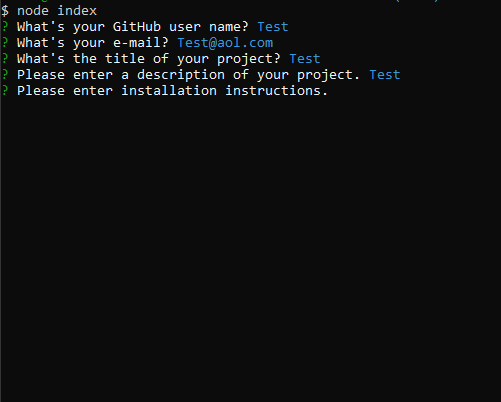
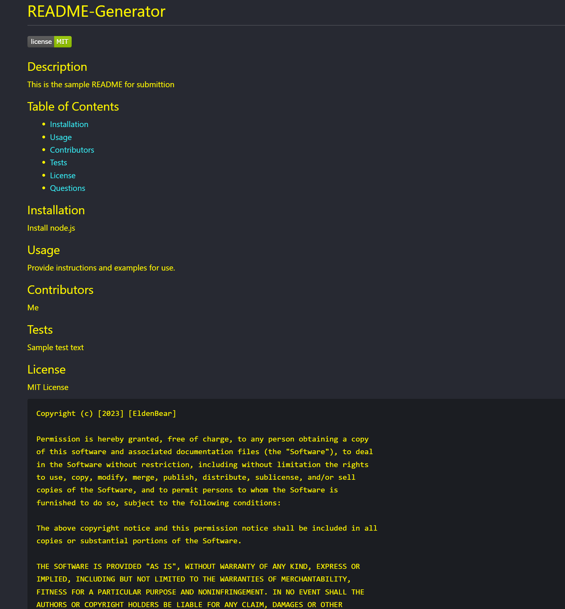

# <Your-Project-Title>

## Description
```
This is a README file generator that takes in input from the user and 
ouputs a quality README for the user to use for their projects and apps.
```


## Usage
```
Screenshots of usage and generated README example:
```

 

